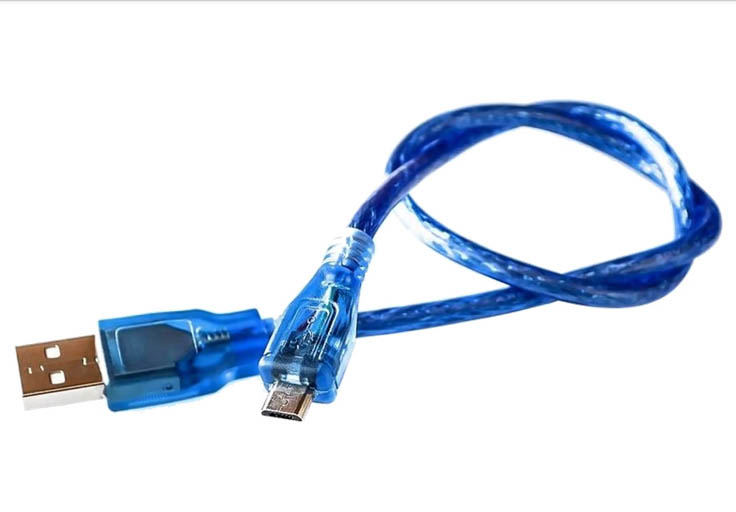

# DHT11 Weather Station
by Erik Lindholm (elimk06@student.lnu.se)</b>
   

Video presentation: https://drive.google.com/file/d/1zn3unwPw_MDlTMTReGX_4Sb3emL21y7W/view?usp=sharing

---

## Description
The DHT11 Weather Station is a simple temperature and humidity sensor connected to an ESP32 MicroController. 
The ESP32 regularly sends sensor readings by WiFi to a web application running on a CSCloud machine. Sensor readings are stored in an InfluxDB database and presented on a web page as Chart.js diagrams, which are automatically updated using Socket.io. The sensor data presented on the page can also be accessed through an API. 
It took me roughly three weeks to finish the project and have the application up and running.

## Objective
I decided to do this project because it seemed fairly straightforward and unintimidating. I had no past experience of working with hardware and IoT-solutions, and I couldn't recall much of what was taught during my electronics classes in high school. 
Just having to order components with only a vague idea of what to build and what parts were required felt challenging enough. So, I decided that the best way to go was to not set the bar too high, but start out with something simple and then add more parts and functionality if time allowed it. I believe the DHT11 Weather Station is a suitable project for anyone who wants to familiarize themselves with the basic concepts of microcontrollers and IoT, rather than build something extraordinary. 
Since I had some experience of C programming, I chose to use the Arduino IDE with the ESP32 device rather than MicroPython. Writing the ESP32 code in C++ might seem difficult to someone who is used to high-level languages, but there was very little code to write for the device. 
The choice of the ESP32 as the platform was mainly due to it being available at a good price. While I was considering using LoRaWan or some other wireless solution, the fact that the ESP32 had built-in WiFi connectivity aligned well with the ambition of starting out simple. 

## Materials
I ended up purchasing all the materials in two orders from Sizeable.se, which turned out to have very good prices. Both orders arrived the day after they had been placed. In order to build the DHT11 Weather Station, you will need the following (all images are taken from Sizable.se):

### ESP32 device (94 SEK)

https://sizable.se/P.CE9S1/ESP32

This is the microcontroller that is running the DHT11 sensor and regularly sends updates to the web application. It has built-in wi-fi connectivity.

### DHT11 Temperature and Humidity Sensor (28 SEK)

https://sizable.se/P.WGXR4/DHT11-Temperatur-och-luftfuktighetssensor

A cheap, basic sensor for measuring temperature and humidity.

### Micro USB cable (18 SEK)

https://sizable.se/P.VC1YX/Micro-USB-kabel-50-cm

Necessary to connect the ESP32 to the computer and provide electricity to the ESP32. You probably already have one lying around that could do the job - however, make sure that it's capable of transferring data and not just electricity, as some USB cables aren't designed for data transfer.

You can connect the DHT11 to the ESP32 either by using male-female cables and a breadboard, or directly by female-female cables. Using female-female cables is most straightforward, but the first option might be better if you want to try adding some more components to the circuit. I went with the breadboard and male-female cables.

### Option 1:

### Breadboard (34 SEK)

https://sizable.se/P.SFGYT/Kopplingsdack-med-400-punkter

### Cables, male/female (24 SEK)

https://sizable.se/P.3V1BE/Dupont-kopplingskablar-Hane-Hona-40-pin

### Option 2:

### Cables, female/female (24 SEK)

https://sizable.se/P.4LTWU/Dupont-kopplingskablar-Hona-Hona-40-pin

The total price for option 1 is <b>198 SEK</b>, and <b>164 SEK</b> for option 2.

## Basic Arduino IDE and ESP32 setup
After connecting the ESP32 to the computer by the USB cable, I installed the Arduino IDE and followed the steps in the tutorial <i>Installing the ESP32 Board in Arduino IDE</i> (https://randomnerdtutorials.com/installing-the-esp32-board-in-arduino-ide-windows-instructions/).

## Connecting the DHT11 sensor
Once the code was successfully running, I proceeded to follow the tutorial <i>ESP32 with DHT11/DHT22 Temperature and Humidity Sensor using Arduino IDE</i> (https://randomnerdtutorials.com/esp32-dht11-dht22-temperature-humidity-sensor-arduino-ide/). 
I first tried to follow the circuit diagrams provided in the tutorial, but every time I closed the circuit the ESP32 would disconnect. I also noticed that it quickly got very hot on the underside of the USB-port. 
At first, I thought the problem was that I had skipped connecting a resistor despite the circuit diagram showing one (the tutorial says that the DHT11:s mounted on a breakout board already has a resistor built in). So, I ordered a set of resistors and other components and added one to the circuit. 
However, the problem persisted. When bringing up the issue during tutoring, I was adviced to skip both the resistor and the breadboard and just connect the ESP32 and DHT11 directly. I still had to use the breadboard since I didn't have any female-female cables, but after simplifying the circuit the LEDs on both the ESP32 and the DHT11 lit up and the console immediately started outputting sensor readings. 
Despite being beginners-level, the tutorial I followed didn't mention the risk of overheating the components, or how to know that you had successfully connected the circuit. Luckily, the components seemed to be undamaged - as a word of caution, keep your finger on the underside of the ESP32 if you're trying this out, and disconnect the circuit if you feel it heating up quickly.

## Should the ESP32 act as a client or a server?
After successfully outputting sensor readings in the Arduino IDE - and testing the sensor by breathing on it and exposing it to the heat of my coffee cup - I started working on the web interface and API. I found another tutorial at randomnerdtutorials.com describing how to set up the ESP32 and sensor as a web server, so my first solution was to have the CSCloud web application send regular GET-requests to the ESP32, which would respond with sensor readings. 
This turned out to be the wrong approach, but it worked out well as long as I was only running the application locally. When I uploaded the application to CSCloud, it wouldn't recognize the ESP32 as it was hidden behind my router. I explored the option of configuring my router to expose the ESP32, but soon realized that this would only temporarily fix the issue - if I were to move the ESP32 to another WiFi network, I would have to go through the same process again. 
It seemed to be a much better solution to redesign both the web application and the ESP32 code so that the ESP32 would act as a client, and regularly send POST-requests with sensor readings to a route on the web application. Following another tutorial, I started by reprogramming the ESP32: https://randomnerdtutorials.com/esp32-http-get-post-arduino/ 
After uploading the redesigned application to CSCloud, the temperature readings would update as expected in the web interface.

## The web interface and the API
 
 
I decided to use InfluxDB as the solution for storing the sensor readings data - mostly because I saw it as a good opportunity to learn the basics of working with time-series databases. 
The first part of the development of the web interface was completely focused on setting up InfluxDB. Without putting much thought into it I used a basic web application during this process, and as a consequence I ended up developing the web interface in parallel with setting up and writing code for the InfluxDB instance. 
A more logical way to go may have been to start with developing the API and then build a web interface that makes use of API. However, it turned out quite well anyway, as code duplication was avoided by having the API and the interface rely on the same methods for retrieving data from InfluxDB. 
The web interface displays the current temperature and humidity, as well as four Chart.js diagrams. The diagrams show the ten last readings, as well as the average temperature and humidity of each day for the last 30 days (or since the first reading, if the device has not yet been active that long.) Every time the server-side application receives a new POST-request from the ESP32, all connected clients are updated in real-time by use of Socket.io. 
Aside from Socket.io, the application is built on the architecture and other solutions commonly used in the 1DV026 assignments, such as Node.js, Express and Handlebars. In the case of an invalid reading, the ESP32 will still do a POST-request but the server-side application will ignore it.

## The final results
The finished web interface is available at https://cscloud8-254.lnu.se/dht11-weather/, and the API can be accessed at https://cscloud8-254.lnu.se/dht11-weather/api/v1. The code for the server-side web application can be found in the "src" folder, and the ESP32 code in the file "esp32-code.cpp".
The ESP32 device is currently connected to a USB charger outlet in my parents' apartment - as soon as I have found a suitable powerbank I plan on moving it to the balcony where it will hopefully produce more varied readings. It currently sends data once every five minutes.

# Reflection

<!-- 
    Your thoughts on the assignment. What was hard, and what have you learned? What could you have done differently? 
-->
<b>Your thoughts on the assignment. What was hard, and what have you learned? What could you have done differently?</b>

The first part of the assignment was definitely the most difficult - it took me a long time to decide on what project to do and which platform to use. I had to go back and re-watch many of the past lectures and standups before I felt that I could make a somewhat educated decision. The recording from the IoT-lab turned out to be extremely useful - I had skipped it at first because I assumed it wouldn't be relevant for me as a remote student. 
The big turning point in my project came when I reconnected the ESP32-DHT11 circuit during tutoring. From the point when the LEDs lit up and the console started outputting temperature readings, the rest of the project proceeded without any major technical challenges. 
InfluxDB was quite easy to get a grip of - at least compared to ElasticSearch - but I found it somewhat complicated to design the API. I haven't yet done the API design assignment, but I remember just enough of the lectures to know that there are a lot of rules to how an API should be designed. I considered trying to follow the Web Thing Model, but since the deadline was approaching and I had a number of unexpected bugs to fix I decided to just do a very minimalistic API.

<b>Further improvements to the assignment. What could you have done but did not have the time to complete?</b>

<!-- 
    Further improvements to the assignment. What could you have done but did not have the time to complete? 
-->

Now that I've become more comfortable with working with hardware, I would like to try adding some more components to the circuit when I have the time. The first priority would be to see if I could connect a lithium battery so the device can operate without being connected to a power outlet. An on/off switch could also be useful. 
Part of me really want to keep experimenting - maybe it was a good thing that I had some problems with the circuit, as I ended up buying a large set of basic components rather than just the necessities for the assignment. Having all the stuff lying around makes it more likely that I will spontaneously start tinkering when I have some more free time. 
There are some minor bugs and improvements to be made on the web interface, for example that the time is currently displayed as UTC rather than local time. The code quality is okay, but I have had to make some workarounds due to the controller methods not being able to call other methods defined within their own classes. This has been a recurring problem for the last assignments - I'm not sure what causes it and I have yet to figure out a good solution.

<b>Have you done anything more than the requirements?</b>

<!--
    Have you done anything more than the requirements? Preferably, add each additional requirement as an issue and reference it here using # followed by the issue id.
-->

No, but just doing the requirements have definitely been both challenging and rewarding enough.

<b>Feedback to the course management about the assignment.</b>

<!-- 
    Feedback to the course management about the assignment.
-->

I didn't have much confidence in my electronics skills, so to some degree I was dreading the IoT section for the entire course. Looking back on the project, it was a great introduction to the subject, and I feel like I now have enough basic knowledge - and components - to explore it further on my own.

<!--
# Assignment - Internet of Things

Hardware and sensors are constantly added to our lives. Sensors produce data, data that often need to be collected and analyzed. Having a basic knowledge of IoT protocols opens many doors for exciting projects as a web developer. This assignment aims to create a thing that connects to the web, a Web Thing. 

## Description

Build a thing that connects to the internet, either independently or through a gateway. The function and if it should have actions, properties, or both are up to you and your project. Create a web interface for your thing. Do you collect a lot of data? Why not show it on a chart?

Looking for inspiration? Please have a look at [some of our example projects](https://coursepress.lnu.se/kurser/webben-som-applikationsplattform/iot/exempel)

## Requirements

The requirements for the assignment are quite vague by design. There are some musts, and even they can be discussed if they are stopping you from achieving your goals.

### Must

* The thing (preferable a microcontroller) must be connected to the web (freestanding, not relayed through a personal computer)
* The thing must be either or both:
    * be accessible through an API
    * have its data presented through an API
* Have a user interface that communicates with the API(s)
* Be presented (see details)

### Should

* Have an API that follows the Web Thing Model

### Could

* Be presented using a public link.
* Implement the API as an implementation of another information model (e.g. Fiware).
* Use a time-series database to store sensor data (e.g. Influx) and add data retention.
* In the report, analyze and reflect on your choices (hardware, protocols, information models, software, data storage, etc., in greater depth).

## Assignment Report

Your application will be presented using a "Tutorial style" assignment report. For details, see the included [template](./Template.md). It is recommended that you replace this README.md with your final report, but you are free to place the report wherever you want as long as it is linked in the Merge Request.

## Merge Request

You hand in the assignment by making a Merge Request of your project against the lnu/submit-branch. It is OK to have additional projects and repositories, but include a link to them in the Submission report. 
Pay extra attention to including a link to your Assignment Report. 
-->